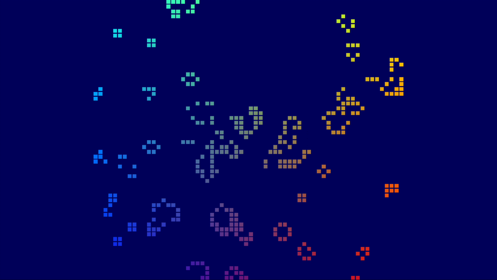

# Conway's Game of Life with WebGPU

## Overview

This repository contains an implementation of the classic Conway's Game of Life simulation that runs entirely on the GPU using the WebGPU API. The project leverages the power of the GPU to handle the computations, resulting in a highly efficient and performant simulation.

## Background

The Game of Life, devised by mathematician John Conway, is a cellular automaton where cells on a grid evolve over discrete time steps according to a set of rules. Each cell can be either alive or dead, and its future state is determined by its current state and the number of living neighbors it has.

## Tutorial Summary

This project was inspired by a tutorial on WebGPU. Here's a brief summary:

- **Introduction to WebGPU:** WebGPU is a modern graphics and compute API that provides access to the GPU from the web. It's designed from the ground up to be efficient, fast, and secure. WebGPU is not WebGL; it's an entirely new API that addresses the needs of modern web applications.

- **Setting up the Development Environment:** The tutorial guides you through setting up the necessary tools and environment for WebGPU development.

- **Creating a WebGPU Context:** This step involves creating a WebGPU context that allows you to interact with the GPU.

- **Shaders and Pipelines:** Learn about writing shaders in WGSL, the WebGPU Shading Language, and how to set up render pipelines.

- **Rendering:** The tutorial covers the basics of rendering with WebGPU, including setting up buffers, bind groups, and drawing.

For a detailed walkthrough, check out the [full tutorial](https://codelabs.developers.google.com/your-first-webgpu-app).

## Running the Simulation

1. Clone the repository!

2. Navigate to the project directory!

3. Open `index.html` in a browser that supports WebGPU.

4. Enjoy the simulation!

## Contributing

Feel free to fork this repository, make changes, and submit pull requests. Any contributions are welcome!

## License

This project is licensed under the MIT License. See the `LICENSE` file for more details.
